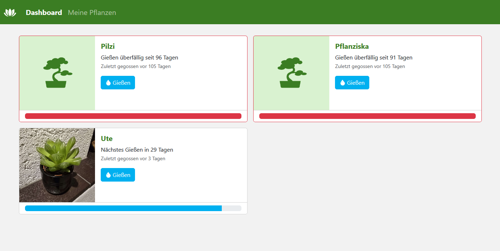

[to the GitHub project ->](https://github.com/orgs/QuadcoreDevelopment/projects/2)

# Plant Manager
Eine mit Node.js, Bootstrap, CSS, JS und HTML entwickelte Webanwendung zur einfachen Verwaltung von Zimmerpflanzen

## Features
- Docker Containers
- Einfache und gut verständliche UI
- Responsive WebUI für Smartphones, Tablets und PC
- REST API
- Trennung zwischen Backend und Frontend
frontend/public/favicon.ico

## Installation
Siehe hierfür: [Installation](docs/Installation.md)

## Ursprung
Diese Webanwendung wurde im Rahmen eines Praktikums an unserer Hochschule erstellt. An der Entwicklung beteiligt waren/sind:
- @CoderTobi
- @ShinyEmeraldGames
- @DuckDev13
- @ITlerOhneGit

## Weitere Informationen
Für weitere Informationen schauen Sie sich gerne die Dokumentation an: [Docs](/docs/README.md)